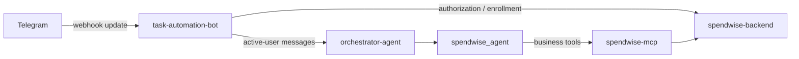

# Task Automation Bot

`task-automation-bot` is the Python service that receives messaging-platform updates and coordinates automation agents. For SpendWise, it receives Telegram webhook updates, routes authorized user messages through the orchestrator and SpendWise agent, and handles Telegram enrollment commands.

## Role in the system

The bot owns Telegram-specific concerns: webhook verification, Telegram user ID extraction, command parsing, Telegram replies, authorization checks, and agent orchestration. It asks `spendwise-backend` whether a Telegram user is active before invoking the agent. The backend is the source of truth for account status and SpendWise identity.

## Responsibilities

- Verify Telegram webhook delivery and extract identity from Telegram updates.
- Handle `/start <invite-token>` and `/setup` outside the LLM/MCP flow.
- Check authorization before sending ordinary messages to any agent.
- Route authorized messages through the orchestrator and relevant agent.
- Provide trusted Telegram request context to downstream business tools.
- Translate backend and agent outcomes into user-facing Telegram replies.

## Boundaries

The backend decides whether a Telegram account is authorized and maps its Telegram ID to a SpendWise user. The bot must not access the SpendWise database. `spendwise-mcp` handles agent-facing business capabilities; it does not own Telegram enrollment or webhook processing. Browser login and the Telegram admin dashboard belong to `spendwise-frontend`.

