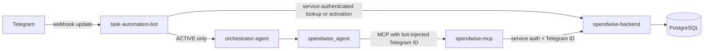

## Telegram authorization and enrollment

The backend is the source of truth for Telegram authorization. The bot extracts the numeric Telegram user ID from the webhook update, handles `/start <invite-token>` at the webhook boundary, and checks authorization directly against the backend before any agent runs. Unknown and blocked users never reach the orchestrator, SpendWise agent, MCP, or business APIs. Authorization and invitation flows are not MCP tools.

An administrator obtains an invite URL from the backend admin API and sends it to the user. Telegram delivers the deep link as `/start <token>`; the bot passes the raw token and Telegram user ID to the protected backend activation endpoint. The backend stores only a SHA-256 hash and atomically consumes the invite while linking the Telegram ID to the targeted SpendWise user. A retry by the same Telegram account is idempotent. The LLM cannot select the account: the bot's MCP interceptor replaces any supplied Telegram ID with the trusted webhook identity, and the backend resolves that ID to its user record.

Configure Telegram's webhook with a random `TELEGRAM_WEBHOOK_SECRET`; Telegram must send it in `X-Telegram-Bot-Api-Secret-Token`. The bot rejects requests with a missing or incorrect secret before trusting the update. Configure each credential for one link only:

- `TELEGRAM_BOT_TOKEN`: task-automation-bot to Telegram.
- `TELEGRAM_WEBHOOK_SECRET`: Telegram webhook to task-automation-bot.
- `SPENDWISE_TELEGRAM_SERVICE_TOKEN`: task-automation-bot to backend for authorization, activation, and memory.
- `SPENDWISE_AUTOMATION_SERVICE_TOKEN`: spendwise-mcp to backend for business APIs.
- `SPENDWISE_TELEGRAM_ADMIN_TOKEN`: administrator to backend invite management.
- `SPENDWISE_MCP_AUTH_TOKEN` in task-automation-bot must match `MCP_AUTH_TOKEN` in spendwise-mcp.

Set `TELEGRAM_BOT_USERNAME` and optional `TELEGRAM_INVITE_EXPIRATION_MINUTES` (default 30). Generate a generic invite with `POST /api/v1/admin/telegram/invites` and `Authorization: Bearer <admin-token>`; no request body or existing SpendWise user ID is needed. Send the returned `inviteUrl` to the person. When claimed, the invite is bound to that Telegram user ID and remains pending. Review pending claims with `GET /api/v1/admin/telegram/claims`, then approve or reject using `POST /api/v1/admin/telegram/claims/<inviteId>/approve` or `/reject`. Verify the Telegram identity out of band before approving. Approval creates the SpendWise user profile and active Telegram mapping. Revoke an unused invite with `POST /api/v1/admin/telegram/invites/<inviteId>/revoke`.
