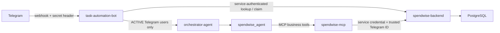

# Task Automation Bot

Python service that receives Telegram webhook updates, checks Telegram authorization with `spendwise-backend`, and routes authorized messages through the orchestrator agent. The orchestrator can call the SpendWise agent, which uses `spendwise-mcp` for business operations.

## Architecture and trust boundaries



This service owns Telegram update parsing and webhook verification. It checks authorization before invoking any agent. `/start <invite-token>` is handled at the webhook boundary and never enters the LLM or MCP. The backend owns account records, invite state, and the final authorization decision. The bot passes Telegram identity taken from the verified update; the SpendWise MCP interceptor replaces any model-supplied identity with that trusted ID.

## Configuration

Copy `configs/env.example` to `.env` and configure the values below. Generate independent random values for webhook/service secrets; never commit `.env`.

| Variable | Purpose |
| --- | --- |
| `TELEGRAM_BOT_TOKEN` | Bot-to-Telegram API calls. |
| `TELEGRAM_WEBHOOK_SECRET` | Validates Telegram's `X-Telegram-Bot-Api-Secret-Token` webhook header. Use the same value when registering the webhook with Telegram. |
| `SPENDWISE_BASE_URL` | Backend API base, normally `http://localhost:8080/api/v1` for local processes. |
| `SPENDWISE_TELEGRAM_SERVICE_TOKEN` | Bot-to-backend auth for Telegram authorization, invite claims, and conversation memory. Must match the backend setting. |
| `SPENDWISE_MCP_URL` | MCP endpoint, normally `http://localhost:9000/mcp` for local processes. |
| `SPENDWISE_MCP_AUTH_TOKEN` | Bot-to-MCP credential; must match `MCP_AUTH_TOKEN` in the MCP service. |
| `OPENAI_API_KEY` | LLM access for the agents. |
| `N8N_MCP_URL`, `N8N_AUTH_TOKEN` | Required by the current agent initialization, which loads the n8n agent at startup. |
| `LANGCHAIN_TRACING_V2`, `LANGCHAIN_API_KEY`, `LANGCHAIN_PROJECT` | Optional LangSmith tracing. |

When services run in separate containers, replace `localhost` with the appropriate Docker service name or host address.

## Install and run

Requires Python 3.12 or newer. From this repository:

```bash
python3 -m venv .venv
source .venv/bin/activate
pip install -r requirements.txt
cp configs/env.example .env
uvicorn app.main:app --host 0.0.0.0 --port 8000
```

The webhook endpoint is `POST /webhook/telegram`. For local Telegram delivery, expose port `8000` through a public HTTPS tunnel, then register `https://<public-host>/webhook/telegram` with Telegram's `setWebhook` method and pass the configured webhook secret as `secret_token`. Telegram sends that secret in a request header for the bot to validate. The root endpoint `GET /` returns a basic running status.

## Generic Telegram enrollment

1. An administrator creates a generic single-use link with the backend `POST /api/v1/admin/telegram/invites` endpoint. No existing SpendWise user ID is needed.
2. The user opens the complete `https://t.me/<bot>?start=<token>` link and taps the Start button on that deep-link screen. Searching for the bot and starting a plain chat may send only `/start`, without the invite token.
3. The bot submits a claim with the Telegram user ID and profile names to the protected backend `POST /api/v1/internal/telegram/claim` endpoint. The backend binds the invite to that first claimant but leaves the account pending.
4. The administrator reviews `GET /api/v1/admin/telegram/claims`, verifies the Telegram identity out of band, and calls `POST /api/v1/admin/telegram/claims/{inviteId}/approve` or `/reject`.
5. Approval creates the SpendWise profile and active Telegram mapping. The user should message the bot again after approval; only active users reach the orchestrator, SpendWise agent, MCP, and business APIs.

After approval, a Telegram user can send `/setup`. The bot asks the backend for a short-lived, one-use link bound to that active Telegram account and sends it back in the chat. The user chooses a username and password on the SpendWise frontend; the bot never sends a temporary password. The backend associates those credentials with the existing profile, so Telegram and browser access map to the same SpendWise user.

The bot cannot identify the intended recipient from a shareable link alone. Admin approval is the access gate; if the wrong Telegram account claims a link, reject it and issue another invite. Authorization and invitations are not MCP tools.
